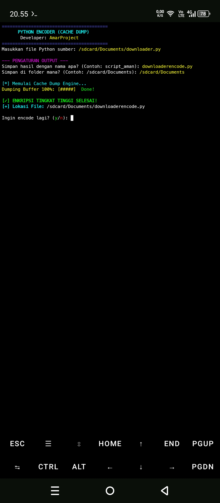

# 🔐 EncoderPro - High Level Python Encoder
**Developer: AmarProject**

EncoderPro adalah tools enkripsi Python tingkat tinggi yang menggunakan teknik **Cache Dump**, **Base85**, dan **Zlib Compression** untuk mengamankan kode sumber Anda dari tangan jahil.

## 🚀 Fitur Utama
* **Cache Dump Engine:** Menyamarkan kode di memori buffer.
* **Multi-Layer Encoding:** Kombinasi Base64 & Base85.
* **Junk Code Generator:** Mengelabui decompiler dengan variabel acak.
* **Custom Output:** Pilih nama file dan folder tujuan sesuka hati.
<p align="center">
  
</p>

## 📥 Instalasi
```bash
pkg update && pkg upgrade
pkg install python git
git clone https://github.com/Amar-star1/EncoderPro
cd EncoderPro
python encoder_pro.py
